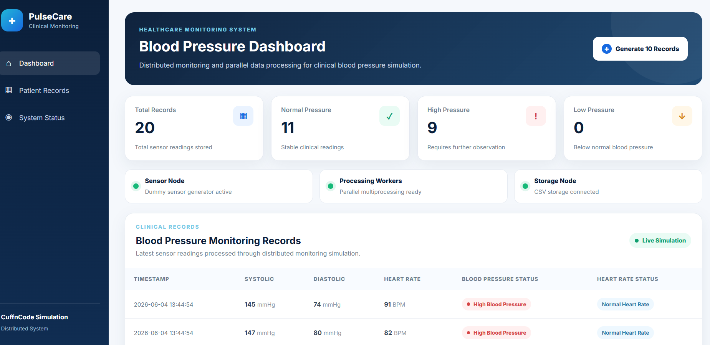
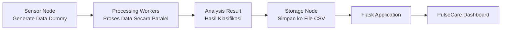
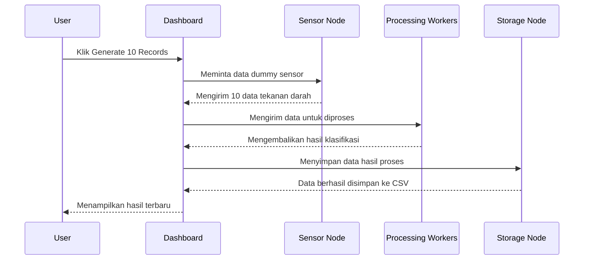

# Distributed Blood Pressure Monitoring Dashboard

Project ini merupakan pengembangan tambahan dari repository **CuffnCode**.

Di project ini, kita membuat simulasi monitoring tekanan darah yang menerapkan konsep **komputasi paralel** dan **sistem terdistribusi**. Data tekanan darah dibuat secara dummy, lalu diproses, diklasifikasikan, disimpan ke file CSV, dan ditampilkan melalui dashboard web.

> **Catatan:**  
> Project ini hanya digunakan untuk simulasi dan pembelajaran.  
> Project ini bukan alat diagnosis medis asli.

---

## Tampilan Dashboard



---

## Gambaran Singkat Project

Repository CuffnCode merupakan project alat pengukur tekanan darah digital yang digunakan untuk kebutuhan pembelajaran dan riset.

Pada kontribusi ini, ditambahkan simulasi berbasis web bernama **PulseCare**. Dashboard ini digunakan untuk menampilkan hasil data tekanan darah secara lebih mudah dan menarik.

Project ini memiliki beberapa fitur utama:

- Menghasilkan data tekanan darah dummy
- Memproses banyak data secara paralel
- Mengklasifikasikan tekanan darah
- Mengklasifikasikan detak jantung
- Menyimpan data ke file CSV
- Menampilkan hasil melalui dashboard web
- Menampilkan status setiap node dalam sistem

---

## Arsitektur Sistem



---

## Alur Sistem Terdistribusi



---

## Penjelasan Alur Program

Secara singkat, alur programnya seperti ini:

```text
User klik tombol Generate 10 Records
                ↓
Sensor Node membuat 10 data dummy
                ↓
Processing Workers memproses data secara paralel
                ↓
Data diklasifikasikan
                ↓
Storage Node menyimpan hasil ke CSV
                ↓
Dashboard menampilkan data terbaru
```

---

## Fitur Utama

### 1. Sensor Node

Sensor Node digunakan untuk menghasilkan data tekanan darah dummy.

Data dummy digunakan karena project ini belum memakai alat sensor fisik secara langsung.

File yang digunakan:

```text
sensor_node.py
```

Data yang dihasilkan:

| Data         | Penjelasan              |
| ------------ | ----------------------- |
| `timestamp`  | Waktu data dibuat       |
| `systolic`   | Tekanan darah atas      |
| `diastolic`  | Tekanan darah bawah     |
| `heart_rate` | Detak jantung per menit |

Contoh hasil data:

```text
{
  'timestamp': '2026-06-04 13:40:00',
  'systolic': 128,
  'diastolic': 82,
  'heart_rate': 76
}
```

---

### 2. Processing Workers

Processing Workers digunakan untuk memproses banyak data secara paralel.

File yang digunakan:

```text
processor.py
```

Pada bagian ini, Python menggunakan:

```python
multiprocessing.Pool
```

Kode utamanya:

```python
with Pool(processes=worker_count) as pool:
    processed_data = pool.map(classify_blood_pressure, sensor_data_list)
```

Maksudnya, data tidak diproses satu per satu saja. Beberapa data bisa dibagi ke beberapa worker agar diproses secara bersamaan.

Contoh sederhananya:

```text
10 data sensor
      ↓
Dibagi ke beberapa worker
      ↓
Diproses secara paralel
      ↓
Hasil digabungkan kembali
```

---

### 3. Klasifikasi Tekanan Darah

Setiap data tekanan darah akan diklasifikasikan menjadi tiga kategori.

| Kondisi                                         | Hasil Klasifikasi     |
| ----------------------------------------------- | --------------------- |
| Systolic di bawah 90 atau diastolic di bawah 60 | Low Blood Pressure    |
| Systolic minimal 140 atau diastolic minimal 90  | High Blood Pressure   |
| Selain kondisi di atas                          | Normal Blood Pressure |

---

### 4. Klasifikasi Detak Jantung

Detak jantung juga akan diklasifikasikan.

| Kondisi                       | Hasil Klasifikasi |
| ----------------------------- | ----------------- |
| Detak jantung di bawah 60 BPM | Low Heart Rate    |
| Detak jantung di atas 100 BPM | High Heart Rate   |
| Selain kondisi di atas        | Normal Heart Rate |

---

### 5. Storage Node

Storage Node digunakan untuk menyimpan data hasil pemrosesan ke file CSV.

File yang digunakan:

```text
storage_node.py
```

Data akan disimpan ke:

```text
data/blood_pressure_records.csv
```

File CSV dibuat otomatis saat program dijalankan.

Contoh isi CSV:

```csv
timestamp,systolic,diastolic,heart_rate,blood_pressure_status,heart_rate_status
2026-06-04 13:40:00,128,82,76,Normal Blood Pressure,Normal Heart Rate
2026-06-04 13:40:00,150,95,88,High Blood Pressure,Normal Heart Rate
```

---

### 6. Dashboard Web

Dashboard digunakan untuk menampilkan hasil monitoring agar lebih mudah dilihat.

Dashboard dibuat menggunakan:

- Flask
- HTML
- CSS
- Jinja Template

Pada dashboard terdapat:

- Total data sensor
- Jumlah tekanan darah normal
- Jumlah tekanan darah tinggi
- Jumlah tekanan darah rendah
- Status Sensor Node
- Status Processing Workers
- Status Storage Node
- Tabel hasil monitoring
- Tombol generate data dummy

---

## Struktur Folder

```text
Distributed-Blood-Pressure-Monitoring/
├── assets/
│   └── dashboard-preview.png
├── data/
│   └── blood_pressure_records.csv
├── static/
│   └── style.css
├── templates/
│   └── index.html
├── app.py
├── processor.py
├── sensor_node.py
├── storage_node.py
├── requirements.txt
├── README.md
└── .gitignore
```

---

## Fungsi Setiap File

| File                   | Fungsi                                               |
| ---------------------- | ---------------------------------------------------- |
| `sensor_node.py`       | Membuat data tekanan darah dummy                     |
| `processor.py`         | Memproses dan mengklasifikasikan data secara paralel |
| `storage_node.py`      | Menyimpan dan membaca data dari CSV                  |
| `app.py`               | Menghubungkan semua bagian program dengan Flask      |
| `templates/index.html` | Struktur tampilan dashboard                          |
| `static/style.css`     | Desain tampilan dashboard                            |
| `requirements.txt`     | Daftar library yang dibutuhkan                       |
| `.gitignore`           | Mengatur file yang tidak perlu ikut di-push          |
| `README.md`            | Dokumentasi project                                  |

---

## Cara Menjalankan Project

### 1. Masuk ke folder project

```bash
cd Distributed-Blood-Pressure-Monitoring
```

### 2. Install library yang dibutuhkan

```bash
pip install -r requirements.txt
```

### 3. Jalankan aplikasi

```bash
python app.py
```

### 4. Buka dashboard

Buka alamat berikut melalui browser:

```text
http://127.0.0.1:5000
```

---

## Cara Menggunakan Dashboard

1. Buka dashboard melalui browser.
2. Klik tombol **Generate 10 Records**.
3. Sensor Node akan membuat 10 data dummy.
4. Processing Workers akan memproses data secara paralel.
5. Storage Node akan menyimpan data ke CSV.
6. Dashboard akan menampilkan hasil terbaru secara otomatis.

---

## Teknologi yang Digunakan

| Bagian             | Teknologi                 |
| ------------------ | ------------------------- |
| Bahasa Pemrograman | Python                    |
| Framework Web      | Flask                     |
| Komputasi Paralel  | Python Multiprocessing    |
| Penyimpanan Data   | CSV                       |
| Frontend           | HTML, CSS, Jinja Template |

---

## Penerapan Materi

Project ini menerapkan beberapa konsep utama:

### Komputasi Paralel

Beberapa data sensor diproses secara bersamaan menggunakan beberapa worker.

### Sistem Terdistribusi

Setiap proses dibuat terpisah menjadi beberapa node:

```text
Sensor Node
Processing Workers
Storage Node
Dashboard
```

Setiap node memiliki tugas masing-masing, tetapi tetap saling terhubung dalam satu alur sistem.

---

## Kontributor

Project ini dibuat untuk memenuhi tugas **Evaluasi 3 — Komputasi Paralel dan Sistem Terdistribusi**.

| Nama             | NRP       |
| ---------------- | --------- |
| Alfarezal Fathir | 152024143 |

---

## Lisensi dan Penggunaan

Project ini merupakan pengembangan tambahan dari repository CuffnCode.

Dashboard PulseCare hanya digunakan untuk kebutuhan pembelajaran, simulasi, dan demonstrasi sistem terdistribusi.
