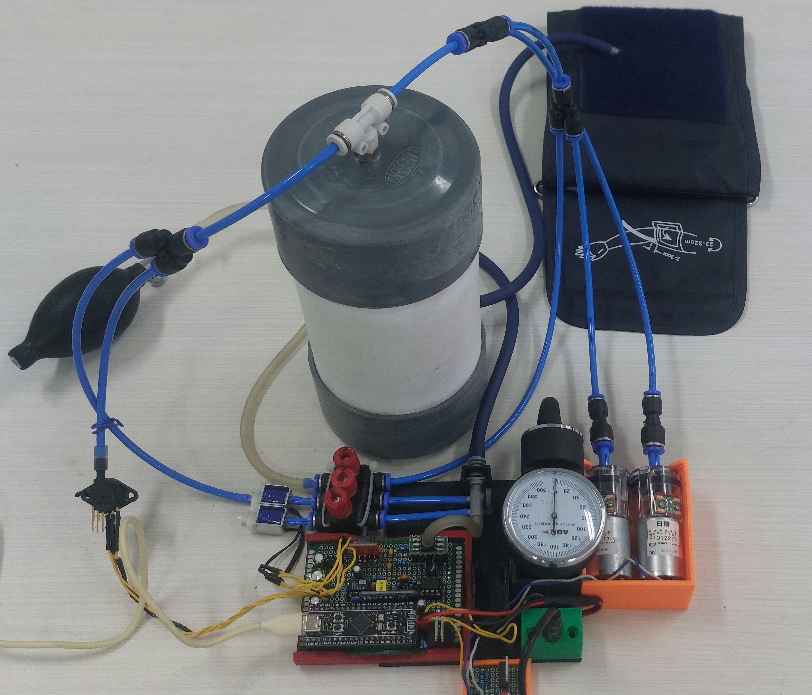

<p align="center">
  
</p>

<h4 align="center">This project is funded by IFAC Activity Fund (July 2025 to June 2026)</h4>

**CuffnCode** is a retrofitted blood pressure measurement system for teaching and research. In the long term, it aims to become an overinstrumented platform for developing and testing signal processing and control algorithms.

**Fork tim kuliah:** [Farmil23/CuffnCode](https://github.com/Farmil23/CuffnCode) — kontribusi **Host-Simulation** untuk mata kuliah **IFB 206 Komputasi Paralel dan Sistem Terdistribusi** (ITENAS, EVALUASI 3, Semester Genap 2025/2026).

Repo hardware asli: [Student-Embedded-Control-and-AI-Fest/CuffnCode](https://github.com/Student-Embedded-Control-and-AI-Fest/CuffnCode)

---

## Ringkasan kesesuaian dengan matkul

| Aspek kurikulum IFB 206 | Implementasi di repo ini | Lokasi kode |
|-------------------------|--------------------------|-------------|
| **Data parallelism** (task sama, data berbeda) | `multiprocessing.Pool.map` memproses chunk waveform secara paralel | `Host-Simulation/src/parallel_pipeline.py` |
| **Scheduling / load balancing** | Perbandingan `chunksize` tetap vs dinamis (`chunksize=1`) | `parallel_pipeline.run_benchmark()` |
| **Sistem terdistribusi** | Tiga proses logis A→B→C dengan **message passing** (`Queue`) | `Host-Simulation/src/distributed_nodes.py` |
| **Pemrosesan sinyal (studikasus)** | Notch 50 Hz + moving average pada sinyal cuff simulasi | `Host-Simulation/src/filters.py` |
| **Demonstrasi & dokumentasi** | GUI Tkinter + benchmark terminal + GitHub Pages | `Host-Simulation/gui.py`, `docs/` |

Program berjalan (sudah diverifikasi di Windows): `python main.py` menjalankan benchmark paralel dan pipeline terdistribusi; `python gui.py` membuka simulator interaktif.

> **Catatan speedup:** pada dataset simulasi (~4800 sampel), overhead `spawn` di Windows sering membuat waktu paralel *lebih lama* dari sequential. Itu wajar untuk tugas — yang dinilai adalah **pola**, segmentasi data, dan arsitektur node, bukan angka speedup tinggi pada data kecil.

---

## Host simulation — Komputasi Paralel (ITENAS IFB 206)

Tim mengembangkan **lapisan Host (PC)** dari rantai CuffnCode: setelah ADC STM32, sinyal tekanan cuff perlu difilter (hum 50 Hz, noise) sebelum estimasi tekanan. Tanpa hardware fisik, modul ini mensimulasikan sensor, AFE, MCU, dan Host dengan:

- **Data parallelism** — pembagian waveform menjadi chunk; filter identik di tiap worker (`Pool`)
- **Distributed pipeline** — Node **A** (acquisition) → **B** (processing) → **C** (storage/UI) via antrian pesan
- **GUI** — diagram blok hardware CuffnCode + grafik **SEBELUM / SESUDAH** filter

### Menjalankan

```bash
cd Host-Simulation
pip install -r requirements.txt
python gui.py          # simulator + grafik (disarankan untuk demo)
python main.py         # benchmark terminal: paralel + distributed
```

### Dokumentasi lengkap (GitHub Pages)

- Situs: aktifkan **Pages** dari folder `/docs` pada branch `main` → URL: `https://farmil23.github.io/CuffnCode/`
- Markdown sumber: [`docs/index.md`](docs/index.md) · versi HTML statis: [`docs/index.html`](docs/index.html)
- Detail teknis modul: [`Host-Simulation/docs/index.md`](Host-Simulation/docs/index.md)

### Tim & peran

| Nama | NRP | Kelas | Peran |
|------|-----|-------|-------|
| **Farhan Kamil Hermansyah** | 152024150 | CC | Implementasi Host-Simulation (GUI, pipeline paralel & terdistribusi, dokumentasi) |
| Ratu Qolbu Maziah | 152024151 | CC | Tim kelas / dokumentasi |
| Syafa Meisya Fitria | 152024182 | AA | Tim kelas / dokumentasi |

### Struktur folder Host-Simulation

| Path | Fungsi |
|------|--------|
| `gui.py` | Entry point GUI |
| `main.py` | Menjalankan benchmark paralel lalu demo distributed |
| `src/parallel_pipeline.py` | Data parallelism + perbandingan sequential/parallel |
| `src/distributed_nodes.py` | Simulasi 3 node + `Queue` |
| `src/filters.py` | Notch 50 Hz, moving average, `process_chunk` |
| `src/signal_generator.py` | Waveform cuff sintetis |
| `src/gui_app.py` | Antarmuka Tkinter |
| `src/cuffncode_specs.py` | Spesifikasi hardware untuk telemetri GUI |

Referensi desain hardware: [Obsidian — CuffnCode](https://publish.obsidian.md/auralius/Published/CuffnCode)

---

## Retrofitted pump system



## Analog Front End Design

A reproducible, low-noise analog front end for millivolt bridge sensors (e.g., MPS20N0040D, typically used for **hobbyist** sphygmomanometer), using AD620 instrumentation amplifier and TLC2272 level shift. This analog front end should also work for other millivolt instruments.

### TINA-TI

AC simulation with TINA-TI:


Instrumentation amplifier gain:

$$ G = 1 + \frac{49.4\text{k}\Omega}{R_g} = 1 + \frac{49.4\text{k}\Omega}{470} \approx 105$$

TLC2272 offset:

$$ \frac{56 \text{k}}{47\text{k} + 56 \text{k}} \times 3.3 V \approx 1.5 V$$

### MPS20N0040D

The MPS20N0040D is a millivolt-level bridge (≈50–100 mV full-scale; 4–6 kΩ)

|  |  |
| --------------------------------------------------- | --------------------------------------------------- |

### TLC2272 (Dual, Low-Noise, Rail-To-Rail Operational Amplifier)

This will be used to offset the instrumentation amplifier, giving headroom for possible undershoot or for signal that goes both ways (positive and negative).


### AD620

This is the instrumentation amplifier that is relatively cheap and widely available in Indonesian market.

|  |  |
| -------------------------------------------- | -------------------------------------------- |

## Digital Controller

We will use STM32F411CE (the black pill) as our digital processor.

|  |  |
| ----------------------------------------------- | ----------------------------------------------- |

## Safety & Notes

- The MPS20N0040D is fragile—avoid over-pressure.
- If powering from USB, beware ground noise from the host PC. A ferrite on the USB cable can help.
- Estimasi BP di **Host-Simulation** hanya untuk demo kuliah — **bukan** diagnosis medis.

## Next-to-Do (repo hardware)

- 50/60 Hz notch filter (hum killer) — **diimplementasikan di simulasi Host** (`filters.notch_50hz`)
- PCB layouting.
- Performance evaluations.
- Integrasi stream ADC nyata dari STM32 ke pipeline Host.

## Credits

- Instrumentation amplifier intro: https://www.youtube.com/watch?v=O0-iczIq1aU
- INA333 review with AD620 suggestion: https://blog.robertelder.org/cjmcu-333-ina-333-instrumentation-amplifier/
- A Designer's Guide to Instrumentation Amplifiers (3rd Edition) https://www.analog.com/media/en/training-seminars/design-handbooks/designers-guide-instrument-amps-complete.pdf
