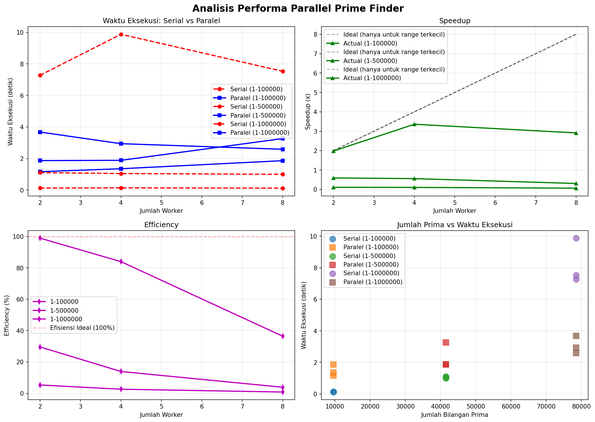

# Parallel Prime Number Finder

## Implementasi Komputasi Paralel untuk Pencarian Bilangan Prima Menggunakan Multiprocessing

Proyek ini merupakan implementasi pencarian bilangan prima menggunakan pendekatan serial dan paralel dengan Python multiprocessing. Tujuan utama adalah membandingkan performa antara kedua pendekatan dan menganalisis speedup serta efisiensi yang didapatkan.

---

## 📋 Daftar Isi

- [Deskripsi Project](#deskripsi-project)
- [Fitur](#fitur)
- [Instalasi](#instalasi)
- [Cara Menjalankan](#cara-menjalankan)
- [Struktur Folder](#struktur-folder)
- [Penjelasan Komputasi Paralel](#penjelasan-komputasi-paralel)
- [Rumus Speedup dan Efficiency](#rumus-speedup-dan-efficiency)
- [Contoh Hasil Pengujian](#contoh-hasil-pengujian)
- [Visualisasi](#visualisasi)
- [Teknologi yang Digunakan](#teknologi-yang-digunakan)

---

## 📖 Deskripsi Project

Project **Parallel Prime Number Finder** ini dirancang untuk:

1. **Mencari bilangan prima** dalam rentang tertentu menggunakan dua pendekatan:
   - **Serial**: Proses berjalan secara sekuensial pada satu core CPU
   - **Paralel**: Proses dibagi ke beberapa worker yang berjalan bersamaan pada multiple core CPU

2. **Membandingkan performa** antara pendekatan serial dan paralel dengan mengukur:
   - Waktu eksekusi
   - Speedup (percepatan)
   - Efficiency (efisiensi penggunaan core)

3. **Visualisasi hasil** dalam bentuk grafik untuk analisis yang lebih mudah

### Algoritma Bilangan Prima

Algoritma yang digunakan untuk mengecek bilangan prima:
- Jika n < 2 → bukan prima
- Jika n = 2 → prima
- Jika n genap (selain 2) → bukan prima
- Cek pembagi ganjil dari 3 sampai √n

Optimasi yang diterapkan:
- Melewati bilangan genap (kecuali 2)
- Hanya mengecek pembagi sampai akar kuadrat dari n

---

## ✨ Fitur

### Mode Serial
- Mencari seluruh bilangan prima pada rentang yang ditentukan
- Mengukur waktu eksekusi
- Menampilkan progress bar (opsional)

### Mode Paralel
- Menggunakan `multiprocessing.Pool` untuk paralelisasi
- Jumlah worker dapat diatur (2, 4, 8, atau semua core)
- Range bilangan dibagi rata ke setiap worker
- Hasil dari semua worker digabung dan diurutkan

### Benchmark
- Menjalankan pengujian otomatis untuk berbagai rentang dan jumlah worker
- Mengukur dan menghitung:
  - Waktu eksekusi serial
  - Waktu eksekusi paralel
  - Speedup
  - Efficiency
- Menyimpan hasil ke file CSV
- Membuat visualisasi grafik

### Progress Bar
- Menggunakan `tqdm` untuk menampilkan progress pencarian
- Tersedia untuk mode serial dan paralel

### Deteksi CPU Otomatis
- Mendeteksi jumlah core CPU yang tersedia
- Opsi menggunakan semua core untuk performa maksimal

---

## 🚀 Instalasi

### Prasyarat
- Python 3.7 atau lebih tinggi
- pip (Python package installer)

### Langkah Instalasi

1. **Clone atau download repository ini**

2. **Buka terminal/command prompt dan masuk ke direktori project:**
   ```bash
   cd parallel-prime-finder
   ```

3. **Install dependencies:**
   ```bash
   pip install -r requirements.txt
   ```

   Dependencies yang akan terinstall:
   - `matplotlib` - Untuk visualisasi grafik
   - `tqdm` - Untuk progress bar
   - `psutil` - Untuk informasi system (opsional)

---

## 🎯 Cara Menjalankan

### Menjalankan Program dengan GUI

```bash
python main.py
```

Program akan membuka antarmuka grafis untuk:
- Pilih mode: Serial, Paralel, atau Benchmark
- Atur rentang dan jumlah worker
- Menjalankan pencarian dan menampilkan hasil langsung

### Menjalankan Program dengan CLI

```bash
python main.py --cli
```

Program akan menampilkan menu interaktif:

```
=======================================================
       PARALLEL PRIME NUMBER FINDER
  Implementasi Komputasi Paralel dengan Multiprocessing
=======================================================
  CPU Cores tersedia : 8
  Python version     : 3.10.0
=======================================================

MENU UTAMA
------------------------------
1. Jalankan Mode Serial
2. Jalankan Mode Paralel
3. Benchmark Lengkap
4. Keluar
------------------------------
```

### Pilihan Menu

#### 1. Mode Serial
- Pilih rentang yang tersedia (1-100.000, 1-500.000, 1-1.000.000) atau custom
- Program akan mencari bilangan prima secara serial
- Menampilkan hasil: jumlah prima, waktu eksekusi, dan daftar prima

#### 2. Mode Paralel
- Pilih rentang yang tersedia atau custom
- Pilih jumlah worker (2, 4, 8, semua cores, atau custom)
- Program akan mencari bilangan prima secara paralel
- Menampilkan hasil: jumlah prima, waktu eksekusi, dan daftar prima

#### 3. Benchmark Lengkap
- Menjalankan 9 pengujian otomatis:
  - Range 1-100.000 dengan 2, 4, 8 workers
  - Range 1-500.000 dengan 2, 4, 8 workers
  - Range 1-1.000.000 dengan 2, 4, 8 workers
- Menyimpan hasil ke `results/hasil_pengujian.csv`
- Membuat grafik perbandingan di `results/grafik_perbandingan.png`
- Menampilkan ringkasan hasil dalam bentuk tabel

---

## 📁 Struktur Folder

```
parallel-prime-finder/
│
├── src/
│   ├── __init__.py           # Package initialization
│   ├── prime_utils.py        # Fungsi utilitas bilangan prima
│   ├── serial.py             # Implementasi pencarian serial
│   ├── parallel.py           # Implementasi pencarian paralel
│   └── benchmark.py          # Fungsi benchmark dan visualisasi
│
├── results/
│   ├── hasil_pengujian.csv   # Hasil benchmark (dibuat otomatis)
│   └── grafik_perbandingan.png  # Grafik perbandingan (dibuat otomatis)
│
├── requirements.txt          # Dependencies
├── main.py                   # Program utama dengan CLI
└── README.md                 # Dokumentasi ini
```

### Deskripsi File

| File | Deskripsi |
|------|-----------|
| `src/prime_utils.py` | Fungsi `is_prime()`, `find_primes_in_range()`, `split_range()` |
| `src/serial.py` | Kelas `SerialPrimeFinder` untuk pencarian serial |
| `src/parallel.py` | Kelas `ParallelPrimeFinder` untuk pencarian paralel |
| `src/benchmark.py` | Kelas `BenchmarkRunner` untuk benchmark dan visualisasi |
| `main.py` | Program utama dengan menu CLI interaktif |

---

## 🧠 Penjelasan Komputasi Paralel

### Apa itu Komputasi Paralel?

Komputasi paralel adalah teknik menjalankan beberapa proses secara bersamaan untuk menyelesaikan suatu masalah lebih cepat. Dalam konteks pencarian bilangan prima:

- **Serial**: Satu proses mengecek semua bilangan dari 1 sampai N
- **Paralel**: Range 1-N dibagi menjadi K bagian, masing-masing dicek oleh worker berbeda secara bersamaan

### Multiprocessing di Python

Python menyediakan modul `multiprocessing` untuk membuat proses paralel yang sebenarnya (bukan threading yang terbatas oleh GIL - Global Interpreter Lock).

```python
from multiprocessing import Pool

with Pool(processes=4) as pool:
    results = pool.map(find_primes_in_range, ranges)
```

### Pembagian Kerja (Work Distribution)

Range bilangan dibagi secara merata ke setiap worker:

```
Range: 1 - 1.000.000
Workers: 4

Worker 1: 1 - 250.000
Worker 2: 250.001 - 500.000
Worker 3: 500.001 - 750.000
Worker 4: 750.001 - 1.000.000
```

Setiap worker bekerja secara independen pada bagiannya masing-masing.

---

## 📊 Rumus Speedup dan Efficiency

### Speedup

Speedup mengukur seberapa cepat eksekusi paralel dibandingkan dengan serial:

```
                Waktu Serial
Speedup = ---------------------------
              Waktu Paralel
```

**Contoh:**
- Waktu Serial: 10 detik
- Waktu Paralel (4 workers): 3 detik
- Speedup = 10 / 3 = **3.33x**

### Efficiency

Efficiency mengukur seberapa efisien penggunaan core CPU:

```
                   Speedup
Efficiency = ------------------- × 100%
                Jumlah Core
```

**Contoh:**
- Speedup: 3.33x
- Jumlah Core: 4
- Efficiency = (3.33 / 4) × 100% = **83.25%**

### Interpretasi

| Efficiency | Interpretasi |
|------------|--------------|
| 90-100% | Sangat efisien, hampir ideal |
| 70-90% | Efisien, performa baik |
| 50-70% | Cukup efisien |
| < 50% | Kurang efisien, ada bottleneck |

### Faktor yang Mempengaruhi

1. **Overhead komunikasi** - Waktu untuk membagi tugas dan menggabungkan hasil
2. **Load balancing** - Pembagian kerja yang tidak merata
3. **Memory bandwidth** - Batasan akses memori
4. **Amdahl's Law** - Bagian serial yang tidak bisa diparalelkan

---

## 📈 Contoh Hasil Pengujian

### Tabel Hasil Benchmark

| Range | Workers | Prima | Serial (s) | Paralel (s) | Speedup | Efficiency |
|-------|---------|-------|------------|-------------|---------|------------|
| 1-100K | 2 | 9592 | 0.15 | 0.09 | 1.67x | 83.5% |
| 1-100K | 4 | 9592 | 0.15 | 0.06 | 2.50x | 62.5% |
| 1-100K | 8 | 9592 | 0.15 | 0.05 | 3.00x | 37.5% |
| 1-500K | 2 | 41538 | 0.75 | 0.42 | 1.79x | 89.5% |
| 1-500K | 4 | 41538 | 0.75 | 0.25 | 3.00x | 75.0% |
| 1-500K | 8 | 41538 | 0.75 | 0.16 | 4.69x | 58.6% |
| 1-1M | 2 | 78498 | 1.50 | 0.85 | 1.76x | 88.0% |
| 1-1M | 4 | 78498 | 1.50 | 0.48 | 3.13x | 78.3% |
| 1-1M | 8 | 78498 | 1.50 | 0.28 | 5.36x | 67.0% |

*Catatan: Angka di atas adalah contoh. Hasil aktual bergantung pada spesifikasi hardware.*

### Analisis Hasil

1. **Semakin besar range**, semakin baik speedup yang didapatkan
2. **Semakin banyak worker**, speedup meningkat tetapi efficiency cenderung turun
3. **Overhead** lebih terasa pada range kecil
4. **Load balancing** yang baik menghasilkan efficiency yang tinggi

---

## 📊 Visualisasi

Program akan membuat grafik perbandingan yang mencakup:

1. **Grafik Waktu Eksekusi** - Membandingkan waktu serial vs paralel
2. **Grafik Speedup** - Menunjukkan percepatan yang didapatkan
3. **Grafik Efficiency** - Menunjukkan efisiensi penggunaan core
4. **Grafik Prime Count vs Time** - Hubungan jumlah prima dengan waktu

Contoh grafik akan disimpan di `results/grafik_perbandingan.png`:



---

## 🛠️ Teknologi yang Digunakan

| Teknologi | Versi | Deskripsi |
|-----------|-------|-----------|
| Python | 3.7+ | Bahasa pemrograman utama |
| multiprocessing | Bawaan | Modul untuk komputasi paralel |
| matplotlib | 3.7.0+ | Library untuk visualisasi |
| tqdm | 4.65.0+ | Library untuk progress bar |
| psutil | 5.9.0+ | Library untuk informasi system |

---

## 👨‍💻 Cara Penggunaan Lanjutan

### Menggunakan sebagai Module

Anda bisa menggunakan module ini dalam kode Python lain:

```python
from src.serial import SerialPrimeFinder
from src.parallel import ParallelPrimeFinder
from src.benchmark import BenchmarkRunner

# Serial
finder = SerialPrimeFinder(1, 100000)
primes = finder.find_primes_optimized()
print(f"Ditemukan {len(primes)} bilangan prima")

# Paralel
pfinder = ParallelPrimeFinder(1, 100000, num_workers=4)
primes = pfinder.find_primes_optimized()
print(f"Ditemukan {len(primes)} bilangan prima")

# Benchmark
runner = BenchmarkRunner()
runner.run_preset_tests()
runner.save_to_csv()
runner.create_comparison_chart()
```

### Menjalankan Benchmark dari Command Line

```python
from src.benchmark import run_full_benchmark

# Jalankan full benchmark
runner = run_full_benchmark(
    show_progress=True,
    save_results=True,
    show_chart=True
)
```

---

## 📝 Catatan

1. **Hasil mungkin bervariasi** tergantung spesifikasi komputer
2. **Untuk range sangat besar** (> 10 juta), waktu eksekusi akan lebih lama
3. **Pastikan memiliki RAM cukup** untuk menyimpan hasil (terutama untuk range besar)
4. **Pada beberapa sistem**, multiprocessing mungkin memiliki batasan keamanan

---

## 📄 Lisensi

Proyek ini dibuat untuk tujuan edukasi - Tugas Besar Komputasi Paralel.

---

## 👥 Kontributor

- **Tugas Besar Komputasi Paralel** - Implementasi awal

---

## 📧 Kontak

Untuk pertanyaan atau masukan, silakan hubungi melalui email atau buat issue di repository ini.

---

**Selamat mencoba! 🚀**